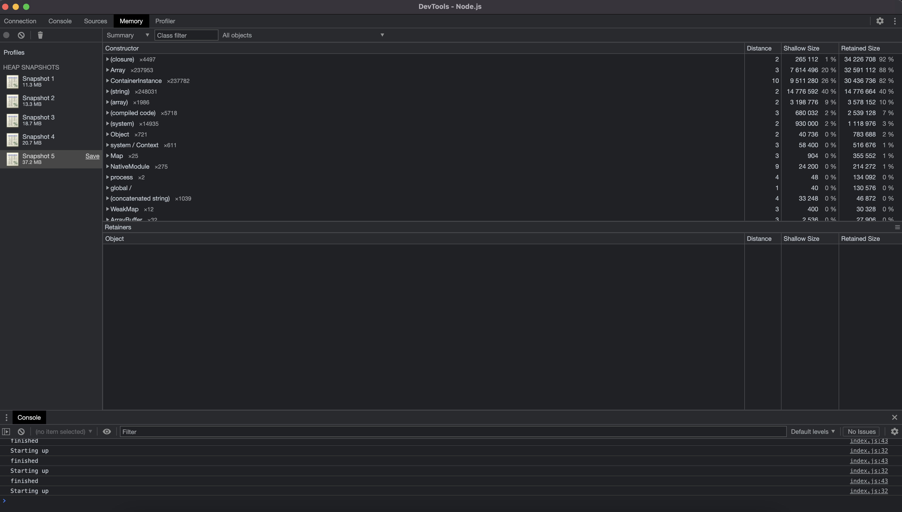

# TypeDI Memory Leak

## Setup
```bash
$ nvm use
$ npm install
```

## Reproduction steps
1. Run `npm run build`
2. Run `npm start` (You should see output appear in the console from here)
3. Open Google Chrome
4. Open Chrome Dev Tools
5. Click the Node.js icon
6. Take periodic Heap snapshots
7. Notice the size of the snapshot increases with each one

## Results from running the process
